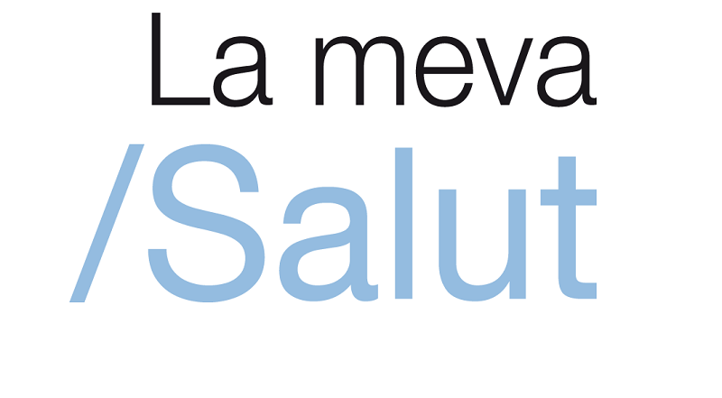

  <!-- You are encouraged to replace this logo with your own! Otherwise you can also remove it. -->
  
   

<h1 align="center">Pocket Doctor</h1>

<i>Enhancing Healthcare System: Introducing an Accessible Digital Doctor Tool</i>

  

<!-- PROJECT DESCRIPTION -->

# 📖 Pocket Doctor 

Welcome to the Pocket Doctor project! This tool is designed to be integrated into the La Meva Salut app, providing virtual doctor services accessible to every person in Catalunya.............

<!-- GITHUB REPOSITORY -->
# 🗂️ Repository Structure 

- **initial_ideas/***: Here, you'll find initial sketches, drawings, and brainstorming materials outlining the conceptualization of the virtual doctor tool.

- **android-studio-code/**: This folder contains the Android Studio code for the La Meva Salut app with the integrated virtual doctor tool.
  
- **vscode-python-scripts/**: Contains Python scripts used for developing models and functionalities for the virtual doctor tool. These scripts are integrated into the application.
  
- **pocket_doctor.pdf**: This is the final paper of the project, providing detailed information about the development, implementation, and functionality of the virtual doctor tool within La Meva Salut.

<!-- AUTHORS -->

# 👥 Authors 

👤 **Júlia Garcia**

  - GitHub: [GitHub Profile](https://github.com/juliagartor)
  - LinkedIn: [LinkedIn](www.linkedin.com/in/julia-garcia-torné)
  - Role: Android Developer
  - Contributions: Developed the app interface using Android Studio, integrated Python emulator for model integration, and optimized app performance.

👤 **Author 2**

  - GitHub: [GitHub Profile](addlink)
  - LinkedIn: [LinkedIn](addlink)
  - Role:
  - Contributions: 

(<a href="#readme-top">back to top</a>)

